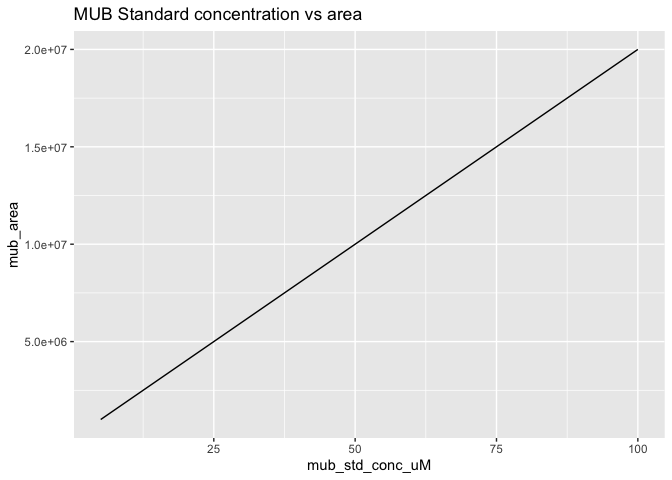
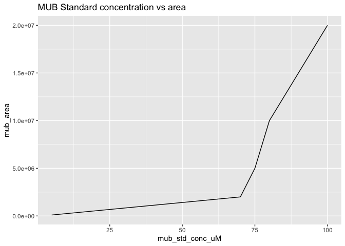
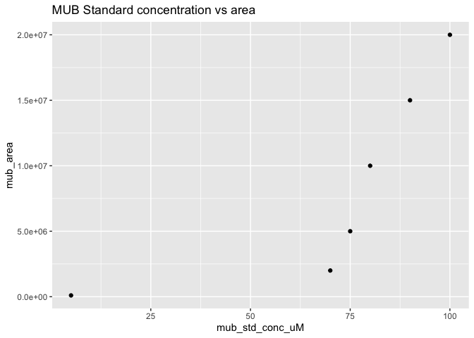
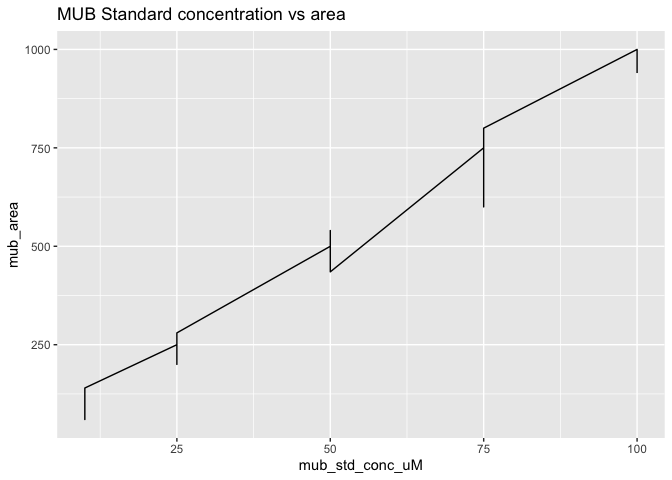
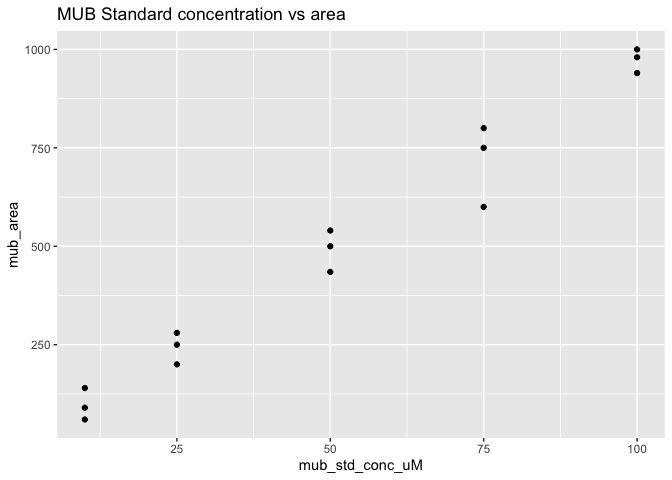
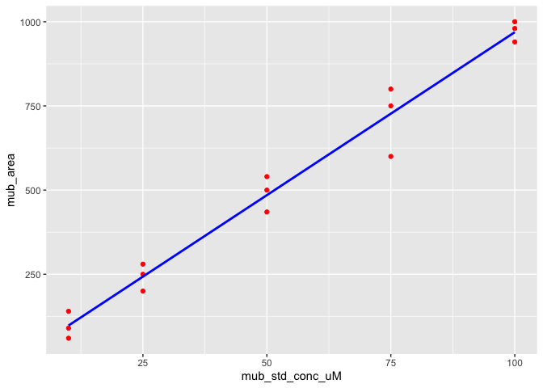
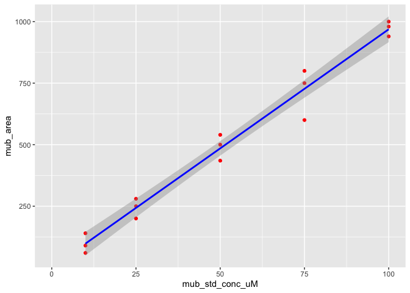

hmk_04
================
murray stokes

I will import and analyzing fake data from a chromatogram displaying the
area from MUB and AMC calibration curves.

This data is fake because I want to use this template to analyze soon to
come, real data, in a easy and reproducible way.

Here I load the tidyverse package and suppress its message.

``` r
library(tidyverse)
```

Here I am loading the csv file and assigning it to the object, stdcurve.

Because I did not specify the column types, an error appears telling me
that column types are unspecified, so I include the argument
“show_col_types = FALSE” to quiet this message.

I also used “col_names” to pass a character vector to use as my column
names.

``` r
stdcurve <- read_csv("fake_chromatogram_data.csv",
                     show_col_types = FALSE,
                     col_names = c("mub_std_conc_uM",
                                   "mub_area",
                                   "amc_std_conc_uM",
                                   "amc_area"))
```

Below I am using geom_line to make a line graph using fake data
representing fluorogenic substrates, MUB and AMC, and possible area
values.

I assign mub_std_conc_uM as the x values and mub_area as the y values.

I used ggtitle to include a title for this figure.

``` r
ggplot(stdcurve) +
  geom_line(aes(x=mub_std_conc_uM, y=mub_area)) +
  ggtitle("MUB Standard concentration vs area")
```



Similarly to the plot above, I use geom_line to make a plot of AMC
standard concentrations vs the reported area.

``` r
ggplot(stdcurve) +
  geom_line(aes(x=amc_std_conc_uM, y=amc_area)) +
  ggtitle("AMC Standard concentration vs area")
```


This is a decent way to look at the relationship between two numerical
variables, but when adding many values of identical x values but
distinct y values, it could be more useful to use a scatter plot and
incorporate a line of best fit.

At my current level of understanding, I believe that a scatter plot
would be more useful as individual points are easily recognized. This is
useful because knowing where the majority of data points lay on a curve,
and lets you know where the more consistent information is.

For example, if 10 data points of a standard curve was acquired, and 9
of those points had x values in the 90-100 range, and the one point had
an x value of 10, then we can’t be entirely confident that the values at
the top of the curve are representative of the information at the
bottom.

Below I am importing a new data set by increasing most of the x values
to higher concentrations

``` r
stdcurve_2 <- read_csv("fake_chromatogram_data_2.csv",
                     show_col_types = FALSE,
                     col_names = c("mub_std_conc_uM",
                                   "mub_area",
                                   "amc_std_conc_uM",
                                   "amc_area"))
```

I am now making a plot using geom_line.

``` r
ggplot(stdcurve_2) +
  geom_line(aes(x=mub_std_conc_uM, y=mub_area)) +
  ggtitle("MUB Standard concentration vs area")
```



Notice that the line makes a sudden shift, and without looking at the
raw data file, we don’t know what points cause this drastic change in
the line.

Using a scatter plot we can determine what points are responsible

``` r
ggplot(stdcurve_2) +
  geom_point(aes(x=mub_std_conc_uM, y=mub_area)) +
  ggtitle("MUB Standard concentration vs area")
```



In this case, the values at 75uM MUB and 5uM MUB are causing this shift.

Below I am importing data that was (fake) measured in triplicate

``` r
stdcurve_3 <- read_csv("fake_chromatogram_data_3.csv",
                     show_col_types = FALSE,
                     col_names = c("mub_std_conc_uM",
                                   "mub_area",
                                   "amc_std_conc_uM",
                                   "amc_area"))
```

I am now using geom_line to make a plot

``` r
ggplot(stdcurve_3) +
  geom_line(aes(x=mub_std_conc_uM, y=mub_area)) +
  ggtitle("MUB Standard concentration vs area")
```



Notice how ugly and awful that is to look at.

Here is a scatter plot of that same data (measured in triplicate)

``` r
ggplot(stdcurve_3) +
  geom_point(aes(x=mub_std_conc_uM, y=mub_area)) +
  ggtitle("MUB Standard concentration vs area")
```



I am now including a regression line for this scatter plot. I set the
point color to red and used the geom_smooth function using the linear
model (“lm”) method to create a blue regression line.

``` r
ggplot(data = stdcurve_3, aes(x = mub_std_conc_uM, y = mub_area)) + geom_point(color = 'red') +
  geom_smooth(method = "lm", se = FALSE, color = 'blue')
```

    `geom_smooth()` using formula 'y ~ x'



“xlim” sets the limits of the x axis to the described range of (0, 100)

“se” in geom_smooth stands for standard error, and if this value was set
to true, we could see a grey hue indicating the confidence interval of
this line.

``` r
ggplot(data = stdcurve_3, aes(x = mub_std_conc_uM, y = mub_area)) + 
  geom_point(color = 'red') + 
  xlim(c(0, 100)) +
  geom_smooth(method = "lm", se = TRUE, color = 'blue') 
```

    `geom_smooth()` using formula 'y ~ x'


