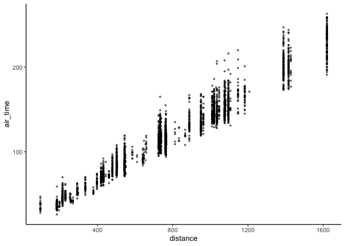
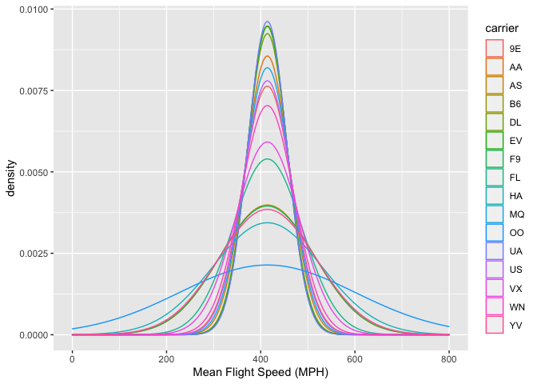

Hmk_05
================
Murray Stokes

## Installing data packages

``` r
library(nycflights13)
library(tidyverse)
```

# Question 1: filtering

Below, I used the filter function to select flights originating from
LaGuardia (LGA), on the 16th of the month, and flight distances less
than 2000 miles. This is assigned to object lga_16_2000

``` r
lga_16_2000 <- filter(flights, origin == "LGA",
       day == 16,
       distance <= 2000)
```

Below I have made a plot of the aforementioned filtered conditions.
`size` changes the size of dots, `alpha` makes dots transparent, and
`theme_classic` is used for aesthetic purposes.

``` r
ggplot(lga_16_2000, aes(x = distance, y = air_time)) +
  geom_point(size = 0.8, alpha = 0.5) +
  theme_classic()
```

    Warning: Removed 75 rows containing missing values (geom_point).


# Question 2: dealing with NAs

Make a data frame of all of the rows of `flights` that have values for
*both* `arr_time` and `dep_time` - that is, neither of those values are
`NA`.

The `&` symbol is used to filter two values that both exist

``` r
dep_arr_times <- filter(flights, arr_time & dep_time)
```

## filtering NAs

I used `na.rm = TRUE` to remove the missing value error message

``` r
lga_16_2000_na <- filter(flights, origin == "LGA",
       day == 16,
       distance <= 2000)


ggplot(lga_16_2000_na, aes(x = distance, y = air_time, )) +
  geom_point(size = 0.8, alpha = 0.5, na.rm = TRUE) +
  theme_classic()
```



# Question 3: adding columns

Create a data frame of average flight speeds, based on `air_time` and
`distance`. Make either a histogram or a density plot of the data. If
you like, you may break the data out (e.g. by airline, or some other
variable) in a way that you think makes sense.

Below I calculate `mean_flight_speed` by dividing `distance` by
`air_time`.

I use `na.rm = TRUE` to omit NA values.

``` r
mean_air_time_hrs <- mean(flights$air_time, na.rm = TRUE) / 60

mean_flight_speed <- mean(flights$distance, na.rm = TRUE) / mean_air_time_hrs
```

Here I create a density plot of each carrier’s `mean_flight_speed`.

Using `scale_x_continuous` I rename the x axis and limit it to (0, 800)

``` r
ggplot(flights, aes(x = mean_flight_speed)) + 
  geom_density(aes(color = carrier),
                 na.rm = TRUE) + 
  scale_x_continuous(name = "Mean Flight Speed (MPH)", 
                     limits = c(0, 800))
```



This is not extremely informative as the colors are difficult to
differentiate. I will use faceting to break up the plots.
