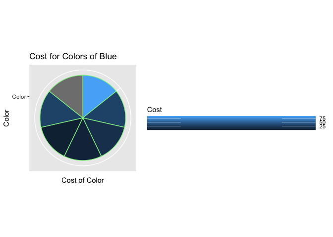

hmk_06
================
Murray Stokes

Loading package and suppressing message

``` r
library(tidyverse)
```

Creating data frame and assigning it to object `bad_plot_df`

``` r
bad_plot_df <- read_csv("badplot_v2.csv", 
                        show_col_types = FALSE, 
                        col_names = c("Color", "Cost") 
)
```

## The Plot

Because ggplot reaaaaalllyy does not want you to make a pie chart, there
is not a standalone geom. Rather, `geom_bar` is used and `coord_polar`
makes it circular.

Various theme functions are also used to make this plot as terrible as
possible

``` r
ggplot(bad_plot_df, aes(x="Color", y="Cost", fill=Cost)) +
  geom_bar(stat="identity", width=1, color="light green") +
    coord_polar("y", start=0) +
  xlab(label = "Color") + ylab(label = "Cost of Color") +
  ggtitle(label = "Cost for Colors of Blue") +
    theme(legend.key.width = unit(6, 'cm')) +
  theme(legend.key.height = unit(0.15, 'cm'))
```



``` r
# gg_save is used to save the file type/name, set pixel density, and dimensions of image.
ggsave("bad_plot.png", dpi=300, height = 8, width = 11, units = "in")
```

The “goal” of this plot is to convey the price of shades of blue. It is
immediately apparent that a pie chart is not appropriate for this goal
as the price of one shade should not be portrayed relative to the
cumulative price of all others.

## Contrasts to Tufte’s rules of graphical excellence:

This plot “distorts what the data has to say” and does not “serve a
reasonably clear purpose.”

## Wilke’s thoughts on axis and legend titles:

Wilke says that, “Axis and legend titles and labels explain what the
displayed data values are and how they map to plot aesthetics”

The axis titles of the above plot describe no data portrayed in the
plot. The legend title could suggest that cost is associated with the
shade of blue, but the represented shades of blue are not accurately
portrayed in the plot.
