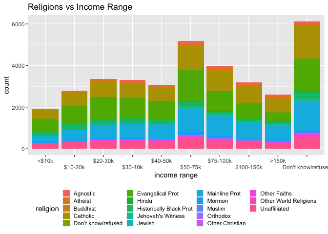
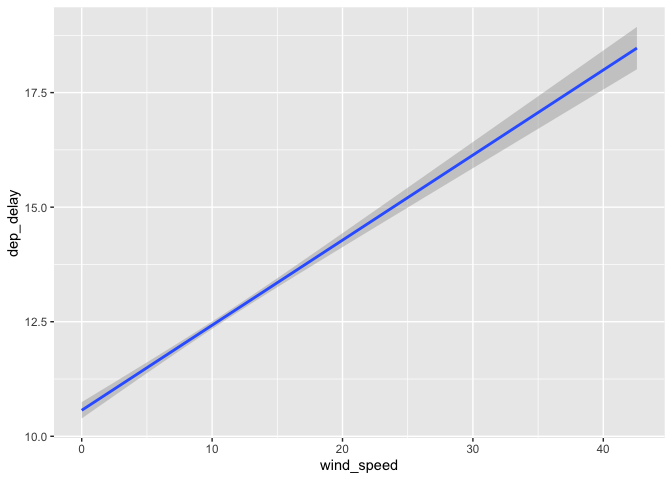

HMK 8: summarising, reshaping, merging
================

``` r
library(tidyverse)
library(nycflights13)
```

# Q1: Summarizing operations and exploratory data analysis

## Q1a

Download `experiment1.csv` from Canvas (under files). This reports two
variables from an experiment that has four treatments. Creatively, the
treatments are `1`, `2`, `3`, and `4`, and the two variables are `x` and
`y`.

Create a data frame that contains the mean, standard deviation, and
number of points for each treatment. You will want to use functions like
`summarise()`, `group_by()`, `mean()`, and `sd()`.

Importing data

``` r
experiment1 <- read.csv("experiment1.csv")
```

Below I use the `group_by` function so I can analyze specific groups
rather than the entire data set when I use the `summarise` function.

I create new columns with informative names indicating the performed
functions `mean` and `sd` for variables `x` and `y`.

``` r
experiment1_stats <- group_by(experiment1, balls)
summarise(experiment1_stats, mean_x = mean(x), mean_y = mean(y),
          sd_x = sd(x), sd_y = sd(y))
```

    # A tibble: 4 × 5
      balls mean_x mean_y  sd_x  sd_y
      <int>  <dbl>  <dbl> <dbl> <dbl>
    1     1      9   7.50  3.32  2.03
    2     2      9   7.50  3.32  2.03
    3     3      9   7.5   3.32  2.03
    4     4      9   7.50  3.32  2.03

Are the data sets different in any important way?

The treatments are not necessarily different from each other. The only
discernible difference is that the standard deviation of the `x`
variable is slightly larger than `y`’s.

## Q1b

Now load the file `experiment2.csv`. Again, this describes two variables
for multiple treatments (here called `dataset`). Answer the same
questions as above.

Importing data:

``` r
experiment2 <- read.csv("experiment2.csv")
```

Carrying out same steps as Q1a:

``` r
experiment2_stats <- group_by(experiment2, dataset)
summarise(experiment2_stats, mean_x = mean(x), mean_y = mean(y),
          sd_x = sd(x), sd_y = sd(y))
```

    # A tibble: 13 × 5
       dataset    mean_x mean_y  sd_x  sd_y
       <chr>       <dbl>  <dbl> <dbl> <dbl>
     1 away         54.3   47.8  16.8  26.9
     2 bullseye     54.3   47.8  16.8  26.9
     3 circle       54.3   47.8  16.8  26.9
     4 dino         54.3   47.8  16.8  26.9
     5 dots         54.3   47.8  16.8  26.9
     6 h_lines      54.3   47.8  16.8  26.9
     7 high_lines   54.3   47.8  16.8  26.9
     8 slant_down   54.3   47.8  16.8  26.9
     9 slant_up     54.3   47.8  16.8  26.9
    10 star         54.3   47.8  16.8  26.9
    11 v_lines      54.3   47.8  16.8  26.9
    12 wide_lines   54.3   47.8  16.8  26.9
    13 x_shape      54.3   47.8  16.8  26.9

Are the datasets different in any important way?

It would not appear that there is any major difference between these
data sets. Variable `x` has a smaller standard deviation than variable
`y`.

# Q2: pivoting

Create a plot that illustrates the differences in income among
religions, using the `relig_income` data set that is built into
tidyverse.

You will need to create a tidy data frame to do this.

``` r
# adding relig_income to my environment so I can look at it easier
relig_income <- relig_income
```

``` r
# using pivot longer and the dplyer::select notation to pivot multiple columns
relig_income_tidy <- relig_income %>% 
  pivot_longer(!religion, names_to = "income", values_to = "count")  %>%
  group_by(religion)

relig_income_tidy$income <- factor(relig_income_tidy$income,
 levels = c("<$10k", "$10-20k", "$20-30k", "$30-40k", "$40-50k", "$50-75k", "$75-100k", "$100-150k", ">150k", "Don't know/refused"))
```

``` r
ggplot(relig_income_tidy, aes(x = income, y = count, fill = religion)) +
  geom_col() +
  scale_x_discrete(guide = guide_axis(n.dodge=2)) +
  labs(x = "income range", y = "count", fill = "religion") +
  guides(fill = guide_legend(ncol=4)) +
  ggtitle("Religions vs Income Range") +
  theme(legend.position = "bottom", legend.key.size = unit(0.8, "lines"))
```



``` r
# I used `theme_update(plot.title = element_text(hjust = 0.5))` in the 
# command line so future plots will have a centered title.
```

# Q3: merging

## Q3a: meaning of joins

Explain the difference between a left join, a right join, an inner join,
and an outer join.

Outer join: `left`, `right` and `full` joins are all types of
`outer joins`

Left join: Preserves observations from the `x` table, should be
preferred join as it keeps original observations if there is not a match
in the `y` table.

Right join: Similar to `left join` but preserves observations from the
second or `y` table.

Full join: Keeps both `x` and `y` observations

Inner join: A join that matches pairs of equal observations

## Q3b: using joins

Using the `flights` and `weather` data sets from `nycflights13`,
determine whether there is a correlation between average hourly wind
speed and departure delays at NY airports.

This is a question about joins: you will need to join the `flights` and
`weather` by year, month, day, and hour. However, note that `flights`
has encoded departure time in a particularly annoying way: as an
integers. For instance, the integer 517 indicates 5:17 am.

`weather` gives average weather conditions each hour, with the hour
given as an integer (e.g., 5 indicating 5-6 am). You’re going to have to
figure out how to convert the time in `flights` into a form that matches
the form in `weather`.

If you want, you can use the `lm()` function to make a linear model of
departure delay as a function of wind speed. But it is also fine to just
make a plot of the two variables with `geom_smooth()`.

``` r
# assinging datasets to objects for ease of access
f <- flights
w <- weather

# dividing `dep_time` by 100 using integer division
f <- f %>%
  mutate(f, hour = dep_time %/% 100) %>%
  select(origin, year, month, day, hour, dep_delay)
```

``` r
weather_grouped <- select(weather, year, month, day, hour, wind_speed)
```

``` r
wf <- weather_grouped %>%
left_join(f, weather_grouped, by = c("year", "month", "day", "hour"))
```

``` r
ggplot(wf, aes(x = wind_speed, y = dep_delay)) +
  geom_smooth(method = "lm")
```

    `geom_smooth()` using formula 'y ~ x'

    Warning: Removed 3651 rows containing non-finite values (stat_smooth).


